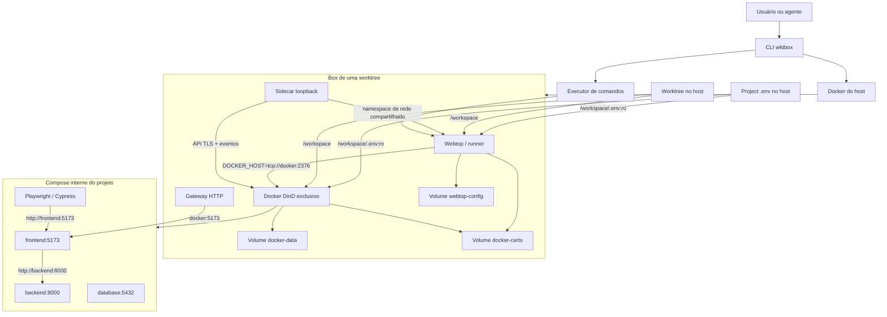
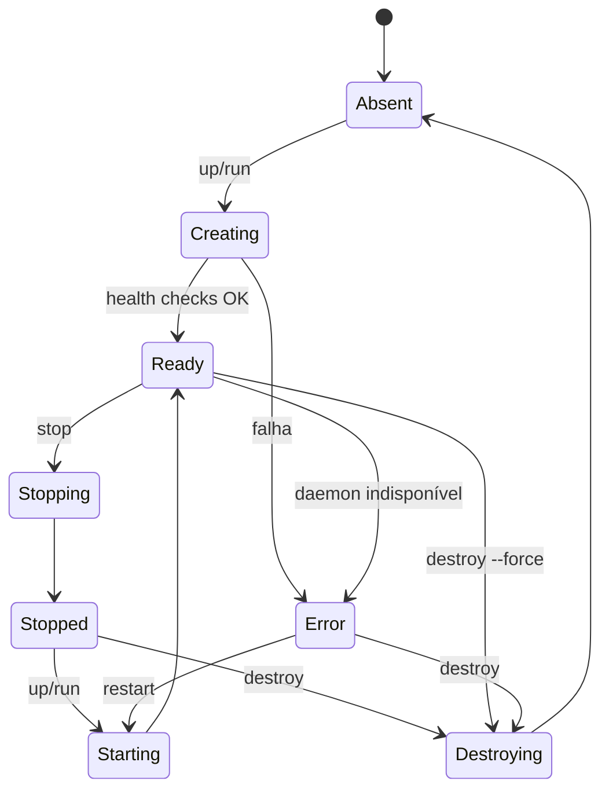

# Wktbox — Plano técnico completo

Status: MVP implementado e validado em Linux; runtime no Docker Desktop/Windows pendente
Nome do produto: **Wktbox**  
Executável: `wktbox`  
Arquivo de configuração: `.wktbox.yml`

## 1. Resumo executivo

O Wktbox será uma CLI multiplataforma que cria um ambiente de desenvolvimento independente para cada Git worktree. Cada ambiente, chamado de **box**, terá:

- uma interface Webtop opcional;
- um daemon Docker-in-Docker (DinD) exclusivo;
- imagens, containers, redes, caches e volumes Docker próprios;
- a worktree montada em `/workspace`;
- um `.env` de projeto opcional montado sem alterar a worktree;
- execução de comandos dentro do ambiente;
- suporte a testes E2E sem remapeamento das portas internas;
- localhost automático no Webtop para toda porta TCP publicada no DinD;
- conexões explícitas e persistentes entre duas ou mais boxes;
- um gateway opcional para acessar serviços pelo navegador do host;
- estado e ciclo de vida controlados pela CLI.

Exemplo principal:

```powershell
wktbox run `
  --path "C:\worktrees\feature-auth" `
  --env-file "C:\envs\feature-auth.env" `
  -- docker compose up --build -d
```

Dentro da própria worktree:

```powershell
wktbox run -- docker compose up --build -d
```

O Wktbox garante que duas worktrees executem simultaneamente o mesmo Compose
contendo portas como `5173:5173`, `8000:3000` e `5432:5432`, sem colisões. As
mesmas portas ficam disponíveis no `localhost` de cada Webtop.

### 1.1 Atualização implementada: loopback automático

O runtime externo inclui o serviço obrigatório `loopback`, executado pela mesma
imagem do Webtop com `network_mode: service:webtop`. O binário Go
`wktbox-loopback` observa a API TLS do DinD, usa apenas
`NetworkSettings.Ports` de containers em execução e abre listeners TCP
atômicos em `127.0.0.1` e `::1`. Cada conexão resolve novamente
`docker:<HostPort>`, portanto a recriação do DinD com outro IP é recuperada sem
reiniciar o Webtop.

O sidecar expõe controle privado em
`/run/wktbox-loopback/control.sock`; `run` e `compose` solicitam sync após
sucesso, enquanto eventos e resync periódico mantêm o estado dinâmico. O
`wktbox status` mostra rotas `listening`, conflitos e avisos UDP sem persistir
esse estado em `state.json`.

As portas internas próprias do LinuxServer Webtop são 61000, 61001 e 61002. O
host publica somente HTTP/HTTPS do Webtop e o gateway opcional; portas das
aplicações continuam exclusivas ao DinD e não aparecem no host.

### 1.2 Atualização implementada: conexões entre boxes

`wktbox connect <box> <box> [mais...]` cria uma bridge rotulada no Docker do
host e anexa os endpoints DinD e Webtop dos membros sem unir seus daemons,
volumes, imagens ou redes internas. Cada DinD recebe o alias estável
`<box-id>.wktbox`; workloads usam esse alias com a porta publicada à esquerda
em `ports:`. `wktbox connections` mostra a topologia humana ou JSON e
`wktbox disconnect` remove apenas a bridge compartilhada.

O sidecar obrigatório `interconnect`, no namespace do DinD, encaminha DNS para
o embedded DNS externo em `127.0.0.11:53`. DinD e sidecar descobrem
dinamicamente o IPv4 da rota padrão privada da box; não dependem de
`172.17.0.1`. O hostname externo do DinD também é único por box para que o nome
TLS privado `docker` nunca fique ambíguo na bridge compartilhada.

As conexões são opt-in e formam uma rede de desenvolvimento confiável entre os
membros. Cada API DinD mantém autoridade TLS própria e o socket Docker do host
continua ausente, mas listeners de peers ficam alcançáveis no nível de rede.

## 2. Problema

Git worktrees separam os arquivos controlados pelo Git e o índice de cada checkout, mas não separam:

- o Docker daemon;
- containers, imagens e redes;
- volumes e bancos de dados;
- portas publicadas;
- caches;
- arquivos `.env`;
- processos e servidores;
- navegadores e sessões de desktop.

Executar vários ambientes sobre o mesmo Docker daemon exige nomes de projeto e portas externas diferentes. Isso obriga o projeto a aceitar configurações dinâmicas e pode quebrar testes E2E, URLs incorporadas no frontend e ferramentas que esperam portas fixas.

O Wktbox resolve o problema criando um Docker daemon completo para cada worktree. O Compose original roda dentro desse daemon e pode manter suas portas, nomes e volumes habituais.

## 3. Objetivos

### 3.1 Objetivos do MVP

1. Criar ou reutilizar uma box a partir de uma worktree.
2. Iniciar um daemon DinD exclusivo para a box.
3. Executar comandos dentro de um ambiente Linux associado à box.
4. Executar Docker Compose dentro da box.
5. Manter imagens, volumes e containers separados entre boxes.
6. Repassar um `.env` externo como `/workspace/.env`.
7. Preservar stdout, stderr, TTY, sinais e código de saída.
8. Parar, reiniciar e destruir uma box seletivamente.
9. Listar boxes, estado, caminhos, portas e URLs.
10. Funcionar inicialmente no Windows com Docker Desktop usando containers Linux.
11. Expor automaticamente no localhost do Webtop toda porta TCP publicada no
    DinD.

### 3.2 Objetivos posteriores

- gerenciamento de artefatos E2E;
- cache remoto ou compartilhado de builds;
- suporte a Linux e macOS;
- suporte opcional a outros runtimes;
- backend baseado em VM para isolamento de segurança forte;
- integração MCP para agentes.

### 3.3 Não objetivos do MVP

- fornecer uma barreira segura para executar código hostil;
- substituir o Git worktree;
- criar branches ou worktrees automaticamente;
- modificar o Compose do projeto;
- reescrever portas da aplicação;
- compartilhar o Docker daemon do host;
- implementar um registry Docker;
- substituir Docker Desktop;
- suportar Kubernetes.

## 4. Terminologia

| Termo | Significado |
|---|---|
| Box | Ambiente Wktbox correspondente a uma worktree |
| Host | Windows, Linux ou macOS onde a CLI é executada |
| Compose externo | Compose usado pelo Wktbox para Webtop, DinD e gateway |
| Compose interno | Compose original do projeto |
| Docker externo | Docker Desktop ou Docker Engine do host |
| Docker interno | Daemon DinD exclusivo da box |
| Worktree | Diretório Git associado à box |
| Project env | `.env` usado pelo projeto e pelo Compose interno |
| Sandbox env | Variáveis geradas pelo Wktbox para o Compose externo |
| Gateway | Proxy que expõe serviços internos ao navegador do host |
| Loopback | Sidecar que espelha portas TCP publicadas no localhost do Webtop |

## 5. Princípios de projeto

1. **Nenhum socket do Docker do host dentro do Webtop.**
2. **Um daemon Docker interno por box.**
3. **A mesma worktree deve aparecer no mesmo caminho absoluto no cliente e no daemon internos.**
4. **Nenhuma modificação automática no Compose do projeto.**
5. **Nenhuma modificação automática no `.env` da worktree.**
6. **Portas da aplicação permanecem fixas dentro da box.**
7. **Apenas Webtop e gateway usam portas únicas no host; portas de aplicação
   são espelhadas somente dentro do Webtop.**
8. **Comandos e operações de ciclo de vida devem ser idempotentes.**
9. **O estado real do Docker deve prevalecer sobre arquivos locais desatualizados.**
10. **A documentação deve chamar o mecanismo de isolamento operacional, não de sandbox de segurança.**

## 6. Arquitetura



## 7. Camadas

### 7.1 Control plane: CLI no host

Responsabilidades:

- descobrir e validar a worktree;
- carregar `.wktbox.yml`;
- resolver caminhos e opções;
- calcular a identidade da box;
- alocar portas externas;
- gerar arquivos do Compose externo;
- iniciar e inspecionar a box;
- executar comandos no Webtop;
- registrar estado;
- controlar locks;
- reconciliar estado local com o Docker;
- parar e destruir recursos;
- apresentar URLs, logs e diagnósticos.

### 7.2 Sandbox externo

Executado pelo Docker do host e composto por:

- `docker`: daemon DinD;
- `webtop`: desktop, terminal e Docker CLI;
- `loopback`: proxy TCP automático no namespace do Webtop;
- `gateway`: proxy HTTP opcional;
- volumes persistentes;
- rede externa exclusiva da box.

O nome do projeto Compose externo será:

```text
wktbox-<box-id-curto>
```

Não serão usados `container_name` fixos.

### 7.3 Workload interno

É o Compose do usuário, sem transformações:

```bash
docker compose up --build -d
```

Os recursos internos pertencem ao daemon DinD daquela box. Portanto, nomes, portas e volumes iguais em boxes diferentes não colidem.

## 8. Identidade da box

O ID deverá ser estável e não depender apenas do nome da branch.

Entrada recomendada:

```text
canonical(git-common-dir) + "\n" + canonical(worktree-path)
```

Resultado:

```text
SHA-256 → primeiros 12 caracteres
```

Exemplo:

```text
boxId: a4f8c9137d2b
projectName: wktbox-a4f8c9137d2b
displayName: feature-auth
```

Consequências:

- renomear a branch não troca a box;
- mover a worktree cria outra identidade;
- duas worktrees da mesma branch em repositórios diferentes não colidem;
- caminhos devem ser normalizados quanto a separadores e caixa no Windows.

Todos os containers externos devem receber labels:

```text
io.wktbox.managed=true
io.wktbox.box-id=a4f8c9137d2b
io.wktbox.worktree=<caminho>
io.wktbox.version=<versão>
```

## 9. Compose externo

O Compose a seguir é uma referência conceitual. A CLI deverá incorporar um template versionado e gerar overrides por box.

```yaml
services:
  docker:
    image: ${WKTBOX_DIND_IMAGE}
    hostname: wktbox-${WKTBOX_ID}-docker
    command:
      - /bin/sh
      - -c
      - >-
        dns_address="$$(ip -4 route get 192.0.2.1 |
        sed -n 's/.* src \([^ ]*\).*/\1/p')";
        test -n "$$dns_address";
        exec /usr/local/bin/dockerd-entrypoint.sh --dns="$$dns_address"
    privileged: true
    environment:
      DOCKER_TLS_CERTDIR: /certs
    volumes:
      - docker-data:/var/lib/docker
      - docker-certs:/certs
      - artifacts:/artifacts
      - type: bind
        source: ${WORKTREE_PATH}
        target: /workspace
    healthcheck:
      test:
        - CMD-SHELL
        - >
          DOCKER_HOST=tcp://localhost:2376
          DOCKER_TLS_VERIFY=1
          DOCKER_CERT_PATH=/certs/client
          docker info
      interval: 3s
      timeout: 3s
      retries: 30

  interconnect:
    image: ${WKTBOX_WEBTOP_IMAGE}
    command: ["wktbox-loopback", "dns-serve"]
    network_mode: service:docker
    depends_on:
      docker:
        condition: service_healthy
    healthcheck:
      test: ["CMD-SHELL", "wktbox-loopback dns-probe"]
      interval: 3s
      timeout: 3s
      retries: 30

  webtop:
    image: ${WKTBOX_WEBTOP_IMAGE}
    depends_on:
      docker:
        condition: service_healthy
    working_dir: /workspace
    environment:
      TZ: ${TZ}
      PUID: ${PUID}
      PGID: ${PGID}
      CUSTOM_PORT: "61000"
      CUSTOM_HTTPS_PORT: "61001"
      CUSTOM_WS_PORT: "61002"
      DOCKER_HOST: tcp://docker:2376
      DOCKER_TLS_VERIFY: "1"
      DOCKER_CERT_PATH: /certs/client
      WKTBOX_ID: ${WKTBOX_ID}
      WKTBOX_WORKSPACE: /workspace
    volumes:
      - docker-certs:/certs:ro
      - webtop-config:/config
      - artifacts:/artifacts
      - type: bind
        source: ${WORKTREE_PATH}
        target: /workspace
    ports:
      - "127.0.0.1:${PORT_HTTP}:61000"
      - "127.0.0.1:${PORT_HTTPS}:61001"
    shm_size: ${SHM_SIZE}

  loopback:
    image: ${WKTBOX_WEBTOP_IMAGE}
    command: ["wktbox-loopback", "serve"]
    network_mode: service:webtop
    depends_on:
      docker:
        condition: service_healthy
      webtop:
        condition: service_started
    environment:
      DOCKER_HOST: tcp://docker:2376
      DOCKER_TLS_VERIFY: "1"
      DOCKER_CERT_PATH: /certs/client
    volumes:
      - docker-certs:/certs:ro
    healthcheck:
      test: ["CMD-SHELL", "wktbox-loopback status --json >/dev/null"]
      interval: 3s
      timeout: 3s
      retries: 30

  gateway:
    image: ${WKTBOX_GATEWAY_IMAGE}
    profiles: ["gateway"]
    depends_on:
      docker:
        condition: service_healthy
    volumes:
      - gateway-config:/etc/wktbox-gateway
    ports:
      - "127.0.0.1:${PORT_GATEWAY}:8080"

volumes:
  docker-data:
  docker-certs:
  webtop-config:
  gateway-config:
  artifacts:
```

### 9.1 Por que usar TLS

O Webtop se conecta ao daemon interno por `tcp://docker:2376` usando os certificados gerados pelo DinD. A API do daemon:

- não é publicada no host;
- usa uma autoridade TLS exclusiva daquela box;
- exige os certificados montados no Webtop;
- não depende de GID do socket Docker.

Uma alternativa futura poderá usar um socket Unix compartilhado, desde que as permissões sejam tratadas sem acoplamento a GIDs do host.

### 9.2 Persistência

| Volume | Persistência |
|---|---|
| `docker-data` | imagens, containers, volumes e cache interno |
| `docker-certs` | certificados do daemon interno |
| `webtop-config` | configurações e perfil do Webtop |
| `gateway-config` | rotas geradas |
| `artifacts` | screenshots, vídeos, traces e relatórios |

`wktbox stop` preserva os volumes.  
`wktbox destroy` remove todos os volumes da box.

## 10. Montagem da worktree

A worktree deve ser montada em `/workspace` tanto no Webtop quanto no DinD.

Motivo:

1. O Docker Compose CLI roda no Webtop.
2. O CLI resolve `.` e caminhos relativos para `/workspace/...`.
3. O daemon que cria containers roda no serviço `docker`.
4. O daemon precisa encontrar os mesmos caminhos absolutos.

Invariante:

```text
host worktree → webtop:/workspace
host worktree → docker:/workspace
```

Sem isso, um Compose contendo:

```yaml
volumes:
  - .:/app
```

pode falhar porque o daemon interno não encontra o caminho enviado pelo cliente.

## 11. Modelo de variáveis de ambiente

Existirão três camadas distintas.

### 11.1 Sandbox env

Gerado pelo Wktbox para configurar o Compose externo:

```env
WKTBOX_ID=a4f8c9137d2b
WORKTREE_PATH=C:\worktrees\feature-auth
PORT_HTTP=23000
PORT_HTTPS=23001
PORT_SSH=23002
PORT_GATEWAY=23003
TZ=America/Sao_Paulo
PUID=1000
PGID=1000
SHM_SIZE=1gb
```

Esse arquivo nunca será usado como `.env` do projeto.

### 11.2 Project env

Informado pelo usuário:

```powershell
wktbox run `
  --path C:\worktrees\feature-auth `
  --env-file C:\envs\feature-auth.env `
  -- docker compose up -d
```

Semântica:

```text
C:\envs\feature-auth.env → /workspace/.env:ro
```

O arquivo será montado no Webtop e no DinD. O Wktbox não deverá:

- copiar o conteúdo para o registro de estado;
- imprimir valores;
- mesclar o arquivo ao sandbox env;
- alterar o arquivo original;
- gravá-lo no repositório.

### 11.3 Command env

Variáveis aplicadas apenas ao processo executado:

```powershell
wktbox run `
  --env CI=true `
  --env DEBUG=e2e `
  -- npm test
```

`--env-file` monta um arquivo. Ele não significa automaticamente “exportar todas as linhas para qualquer comando”. Um futuro `--load-env` poderá oferecer esse comportamento explicitamente.

### 11.4 Destino customizado

```powershell
wktbox run `
  --env-file C:\envs\e2e.env `
  --env-target /workspace/.env.e2e `
  -- docker compose --env-file .env.e2e up -d
```

Padrão:

```text
--env-target /workspace/.env
```

No MVP, destinos devem estar abaixo de:

```text
/workspace
/run/wktbox
```

### 11.5 Precedência

```text
--env-file
  > WKTBOX_ENV_FILE
  > environment.file em .wktbox.yml
  > .env já existente na worktree
  > nenhum project env
```

Se o arquivo indicado já for `/workspace/.env` dentro da worktree, nenhum mount adicional será necessário.

## 12. Ponte Git

### 12.1 Problema

Em uma linked worktree, `.git` normalmente é um arquivo:

```text
gitdir: C:/repos/app/.git/worktrees/feature-auth
```

Esse caminho do Windows não existe no Linux do Webtop. Montar apenas a worktree pode fazer `git status` falhar dentro da box.

### 12.2 Modos propostos

#### `git.mode: host`

Modo mais simples e seguro para o MVP:

- o Webtop edita arquivos;
- comandos Git de alto nível são executados pelo Wktbox no host;
- o diretório Git comum não é montado no Webtop.

Limitação: scripts executados dentro da box que chamam Git podem falhar.

#### `git.mode: mounted`

Modo de desenvolvimento completo:

1. Descobrir `git rev-parse --git-common-dir`.
2. Descobrir o diretório administrativo da worktree.
3. Montar o common dir no Webtop:

```text
<common-dir-do-host> → /wktbox/git-common
```

4. Configurar no Webtop:

```env
GIT_WORK_TREE=/workspace
GIT_DIR=/wktbox/git-common/worktrees/<admin-name>
GIT_COMMON_DIR=/wktbox/git-common
```

Para a worktree principal, `GIT_DIR` será o próprio common dir.

Esse modo precisa ser validado para:

- `git status`;
- `git diff`;
- `git add`;
- `git commit`;
- hooks;
- Git LFS;
- submodules;
- worktrees com caminhos contendo espaços;
- operações que consultam o arquivo `gitdir` administrativo.

Risco: montar o common dir como leitura e escrita permite à box alterar refs e metadados compartilhados do repositório. Isso deve ser documentado.

### 12.3 Decisão recomendada

O spike técnico deve testar `git.mode: mounted`. Se a compatibilidade não for confiável no Windows, o MVP deverá usar `git.mode: host` como padrão e apresentar claramente a limitação.

## 13. Contrato da CLI

### 13.1 Sintaxe geral

```text
wktbox [global-options] <command> [command-options] [-- child-command]
```

Opções globais:

```text
--path <worktree>       Worktree; padrão: diretório atual
--config <arquivo>      Configuração alternativa
--env-file <arquivo>    Project env
--env-target <destino>  Padrão: /workspace/.env
--profile <nome>        Perfil de configuração
--json                  Saída estruturada
--quiet                 Reduz saída
--verbose               Diagnóstico detalhado
--no-color              Desabilita cores
```

### 13.2 Comandos do MVP

#### `wktbox up`

Cria ou inicia a infraestrutura externa:

```powershell
wktbox --path C:\worktrees\feature-a up
```

Não inicia automaticamente o Compose interno.

#### `wktbox run`

Garante que a box está pronta e executa um comando:

```powershell
wktbox run -- docker compose up --build -d
```

#### `wktbox exec`

Executa um comando no Webtop/runner de uma box que já está pronta:

```powershell
wktbox exec -- ls -la
wktbox --path C:\worktrees\feature-a exec -- pwd
```

Por padrão:

- o alvo é o serviço externo `webtop`;
- o diretório é o equivalente a partir de `/workspace`;
- o usuário é o usuário configurado pelo Webtop;
- stdin, stdout, stderr, TTY, sinais e exit code são preservados.

Para comandos simples, a CLI poderá aceitar a forma abreviada:

```powershell
wktbox exec ls -la
```

O separador `--` será a forma canônica e deverá ser usado quando o comando filho possuir opções que possam ser confundidas com opções do Wktbox.

Diferença de ciclo de vida:

```text
wktbox run   → cria ou inicia a box, aguarda saúde e executa
wktbox exec  → exige uma box já pronta e executa imediatamente
```

Se a box estiver parada, `exec` deverá retornar erro com a sugestão:

```text
Box is stopped. Run "wktbox up" or use "wktbox run -- <command>".
```

Para executar em um serviço do Compose interno:

```powershell
wktbox compose -- exec backend ls -la
```

Equivalente a:

```powershell
wktbox exec -- docker compose exec backend ls -la
```

#### `wktbox compose`

Atalho:

```powershell
wktbox compose -- up --build -d
```

Equivalente a:

```powershell
wktbox run -- docker compose up --build -d
```

#### `wktbox shell`

Abre shell interativo em `/workspace`:

```powershell
wktbox shell
```

#### `wktbox open`

Abre a URL do Webtop:

```powershell
wktbox open
```

#### `wktbox list`

Lista boxes:

```powershell
wktbox list
wktbox list --json
```

Campos:

- ID;
- nome;
- worktree;
- branch;
- estado;
- Webtop;
- gateway;
- criação;
- último uso;
- tamanho aproximado.

#### `wktbox status`

Mostra detalhes e saúde de uma box.

#### `wktbox logs`

```powershell
wktbox logs
wktbox logs docker
wktbox logs webtop --follow
```

#### `wktbox stop`

Para a infraestrutura externa sem remover volumes.

#### `wktbox restart`

Reinicia e revalida a infraestrutura.

#### `wktbox destroy`

Remove containers, rede, certificados, imagens e volumes exclusivos da box:

```powershell
wktbox destroy
wktbox destroy --force
```

Deve pedir confirmação em terminal interativo. Em modo não interativo, deve exigir `--force`.

#### `wktbox doctor`

Verifica:

- Docker disponível;
- Docker Compose v2;
- containers Linux;
- permissão de bind mount;
- worktree válida;
- project env válido;
- portas;
- compatibilidade do DinD;
- espaço em disco;
- conexão TLS;
- ponte Git.

### 13.3 Comandos posteriores

```text
wktbox expose
wktbox unexpose
wktbox e2e
wktbox artifacts
wktbox cp
wktbox gc
wktbox snapshot
wktbox config
wktbox mcp
```

## 14. Execução de comandos

O Wktbox executará comandos usando o Compose externo:

```text
docker compose
  -p wktbox-<id>
  -f <sandbox-compose>
  exec
  -w <container-cwd>
  webtop
  <comando>
```

### 14.1 Diretório atual

Se o comando for chamado em um subdiretório da worktree:

```text
host: C:\worktrees\feature-a\frontend
box:  /workspace/frontend
```

Se `--path` apontar para a worktree e a chamada vier de fora dela, o diretório será `/workspace`.

### 14.2 TTY

- terminal interativo: alocar TTY;
- pipe ou CI: usar modo não TTY;
- stdin deve ser preservado;
- `Ctrl+C` deve ser encaminhado;
- o exit code do processo filho deve ser o exit code do `wktbox`.

### 14.3 Quoting

Argumentos após `--` não devem ser reconstruídos como uma string de shell. Devem ser transmitidos como uma lista de argumentos para evitar:

- perda de aspas;
- expansão acidental;
- execução indevida de metacaracteres;
- diferenças entre PowerShell, CMD e Bash.

## 15. Portas

### 15.1 Portas externas da box

Cada box recebe um bloco:

```text
Box 1: 23000–23009
Box 2: 23010–23019
Box 3: 23020–23029
```

Uso inicial:

| Offset | Serviço |
|---:|---|
| 0 | Webtop HTTP |
| 1 | Webtop HTTPS |
| 2 | SSH |
| 3 | Gateway HTTP |
| 4–9 | Reservado |

O algoritmo deve verificar disponibilidade real antes de confirmar a reserva.

### 15.2 Registry e locks

O registro global deverá ficar no diretório de dados da aplicação:

- Windows: `%LOCALAPPDATA%\Wktbox`;
- Linux: `$XDG_STATE_HOME/wktbox` ou fallback documentado;
- macOS: diretório de Application Support.

Arquivos:

```text
state.json
state.lock
boxes/<id>/sandbox.env
boxes/<id>/compose.yml
boxes/<id>/project-env.override.yml
boxes/<id>/gateway/
boxes/<id>/logs/
```

Nunca armazenar o conteúdo do project env.

Deve existir:

- lock global para alocação;
- lock por box para create/start/stop/destroy;
- escrita atômica do estado;
- recuperação de arquivos temporários após crash.

## 16. Gateway

### 16.1 Sem gateway

Dentro do Compose interno:

```text
e2e → http://frontend:5173
frontend → http://backend:8000
```

No navegador do Webtop:

```text
http://docker:5173
```

O gateway não é necessário para o E2E interno.

### 16.2 Gateway HTTP por box

Configuração:

```yaml
gateway:
  enabled: true
  routes:
    frontend:
      port: 5173
    api:
      port: 8000
```

URLs:

```text
http://frontend.<box-id>.localhost:<gateway-port>
http://api.<box-id>.localhost:<gateway-port>
```

Upstreams:

```text
frontend → docker:5173
api → docker:8000
```

Requisitos:

- suporte a WebSocket;
- cabeçalhos `X-Forwarded-*`;
- reload sem reiniciar o DinD;
- health check por rota;
- mensagens claras quando a porta interna ainda não está ouvindo;
- administração não publicada no host.

### 16.3 Exposição TCP automática no Webtop

Implementada sem comando adicional. Um container interno em execução com
`ports: ["5432:5432"]` produz uma rota
`localhost:5432 -> docker:5432` no Webtop. Para `"8000:3000"`, o listener usa
8000, que é o `HostPort` do DinD. A descoberta ignora `EXPOSE` sem publicação e
reporta UDP como não suportado.

Eventos do Docker adicionam e removem listeners sem reiniciar o DinD. Um
conflito afeta somente a porta correspondente e aparece em `wktbox status`.
Essa exposição não publica a porta no host; acesso host-facing permanece
responsabilidade do gateway opcional.

## 17. Testes E2E

### 17.1 Padrão recomendado

O runner E2E deve estar no Compose interno:

```yaml
services:
  frontend:
    build: ./frontend
    ports:
      - "5173:5173"

  backend:
    build: ./backend
    ports:
      - "8000:3000"

  e2e:
    build: ./e2e
    environment:
      BASE_URL: http://frontend:5173
    depends_on:
      - frontend
      - backend
```

Execução:

```powershell
wktbox run -- docker compose run --rm e2e
```

### 17.2 Artefatos

O Wktbox deverá oferecer `/artifacts` no Webtop. O projeto poderá montar esse caminho no runner E2E:

```yaml
e2e:
  volumes:
    - /artifacts:/artifacts
```

Como esse caminho é resolvido pelo DinD, o diretório também deve existir no container `docker`. A implementação deverá montar o volume externo de artefatos no mesmo caminho em `docker` e `webtop`.

Alternativa mais simples para o MVP: gravar artefatos dentro de `/workspace/.wktbox-artifacts`, com recomendação de inclusão no `.gitignore`.

### 17.3 Comando configurável

```yaml
commands:
  e2e:
    command:
      - docker
      - compose
      - run
      - --rm
      - e2e
```

Execução futura:

```powershell
wktbox e2e
```

## 18. Configuração `.wktbox.yml`

Exemplo completo:

```yaml
version: 1

workspace:
  target: /workspace

environment:
  file: .env
  target: /workspace/.env
  readOnly: true

runtime:
  dindImage: docker:<versao-fixada>-dind
  webtopImage: ghcr.io/<organizacao>/wktbox-webtop:<versao>
  gatewayImage: ghcr.io/<organizacao>/wktbox-gateway:<versao>

webtop:
  enabled: true
  shmSize: 2gb
  ssh:
    enabled: false

git:
  mode: host

resources:
  cpus: 4
  memory: 8gb
  pids: 2048

gateway:
  enabled: true
  routes:
    frontend:
      port: 5173
    api:
      port: 8000

commands:
  e2e:
    command:
      - docker
      - compose
      - run
      - --rm
      - e2e

lifecycle:
  idleTimeout: 0
  removeOnWorktreeDelete: false
```

### 18.1 Precedência de configuração

```text
flags CLI
  > variáveis WKTBOX_*
  > .wktbox.local.yml
  > .wktbox.yml
  > defaults internos
```

`.wktbox.local.yml` não deverá ser criado automaticamente e deverá ser recomendado no `.gitignore`.

## 19. Estado e máquina de estados

Estados:



O arquivo de estado é apenas um cache. A reconciliação deve consultar:

- projetos Compose externos;
- labels `io.wktbox.*`;
- containers;
- health status;
- volumes;
- portas realmente publicadas.

## 20. Segurança

### 20.1 Garantias oferecidas

- containers de uma box não aparecem no daemon interno de outra;
- volumes internos não são compartilhados por padrão;
- redes internas são separadas;
- o Webtop não recebe o socket Docker do host;
- a API do DinD não é publicada no host;
- project env é montado como leitura;
- portas externas escutam apenas em `127.0.0.1`.

### 20.2 Garantias não oferecidas

O DinD tradicional usa `privileged: true`. Portanto:

- não é uma barreira adequada para código malicioso;
- processos podem explorar vulnerabilidades de kernel ou runtime;
- acesso ao daemon interno equivale a root dentro do DinD;
- uma fuga do container privilegiado pode afetar o host.

O produto deverá usar termos como:

```text
isolamento de ambiente
isolamento operacional
Docker state isolation
```

e evitar:

```text
execução segura de código não confiável
isolamento de segurança completo
VM-equivalent isolation
```

### 20.3 Hardening

- publicar Webtop e gateway apenas em loopback;
- SSH desligado por padrão;
- autenticação por chave quando SSH estiver ativo;
- nunca usar senha padrão `changeme`;
- limites de CPU, memória e PIDs;
- timeouts;
- imagens fixadas por versão e, posteriormente, digest;
- política de atualização;
- scans de imagens;
- TLS entre Webtop e DinD;
- nenhuma montagem automática de credenciais Docker;
- credenciais Git e SSH somente por opt-in;
- redaction de secrets nos logs;
- administração do gateway não publicada.

### 20.4 Backend seguro futuro

Adicionar uma interface de runtime:

```text
RuntimeBackend
  create()
  start()
  exec()
  stop()
  destroy()
  inspect()
```

Implementações:

```text
dind       MVP
vm         futuro
remote     futuro
podman     possível
```

Um backend VM ou microVM poderá ser usado para código não confiável.

## 21. Experiência no Windows

Requisitos iniciais:

- Windows 10/11;
- Docker Desktop;
- containers Linux;
- Docker Compose v2;
- diretórios compartilháveis pelo Docker Desktop.

Pontos que exigem validação:

- bind mount de worktrees em NTFS;
- bind mounts aninhados usados pelo DinD;
- caminhos com espaços;
- caminhos longos;
- letras de drive;
- caminhos UNC;
- case-insensitivity;
- performance de `node_modules`;
- UID/GID de arquivos criados;
- permissões do project env;
- `.git` de linked worktrees;
- symlinks;
- watch de arquivos;
- WebSocket e hot reload;
- antivírus e indexadores.

Decisão recomendada para o MVP:

- aceitar caminhos locais em drives compartilhados;
- rejeitar UNC inicialmente com mensagem explícita;
- documentar que caches e dependências pesadas devem preferir volumes Docker;
- executar `wktbox doctor` antes da primeira criação.

## 22. Implementação da CLI

### 22.1 Linguagem recomendada

**Go** para o MVP:

- binário único;
- boa compatibilidade Windows/Linux/macOS;
- inicialização rápida;
- biblioteca padrão adequada para processos e arquivos;
- fácil incorporação dos templates;
- distribuição simples.

O MVP deverá chamar o Docker CLI e o Docker Compose instalados, em vez de reimplementar todo o comportamento via API. Isso preserva compatibilidade com o contexto ativo do Docker Desktop.

### 22.2 Estrutura proposta

```text
wktbox/
├── cmd/
│   └── wktbox/
│       └── main.go
├── internal/
│   ├── cli/
│   ├── config/
│   ├── discovery/
│   ├── identity/
│   ├── state/
│   ├── lock/
│   ├── ports/
│   ├── sandbox/
│   ├── compose/
│   ├── executor/
│   ├── environment/
│   ├── gitbridge/
│   ├── gateway/
│   ├── doctor/
│   └── output/
├── assets/
│   ├── sandbox.compose.yml
│   └── gateway/
├── images/
│   ├── webtop/
│   └── gateway/
├── tests/
│   ├── integration/
│   └── e2e/
├── .wktbox.yml
├── go.mod
└── README.md
```

### 22.3 Interfaces internas

```go
type BoxManager interface {
    Ensure(ctx context.Context, spec BoxSpec) (Box, error)
    Start(ctx context.Context, id string) error
    Stop(ctx context.Context, id string) error
    Destroy(ctx context.Context, id string) error
    Inspect(ctx context.Context, id string) (BoxStatus, error)
    List(ctx context.Context) ([]BoxStatus, error)
}

type Executor interface {
    Run(ctx context.Context, box Box, command []string, opts ExecOptions) (int, error)
}

type StateStore interface {
    Load(ctx context.Context) (State, error)
    Save(ctx context.Context, state State) error
    Lock(ctx context.Context) (UnlockFunc, error)
}
```

## 23. Fluxos principais

### 23.1 `wktbox run`

```text
1. Resolver diretório atual e --path
2. Validar Git worktree
3. Carregar configurações
4. Resolver e validar project env
5. Calcular box ID
6. Adquirir lock da box
7. Reconciliar estado local e Docker
8. Alocar portas se a box não existir
9. Gerar sandbox.env
10. Gerar Compose e overrides
11. Iniciar Compose externo
12. Aguardar DinD saudável
13. Validar conexão Docker no Webtop
14. Preparar ponte Git
15. Mapear cwd do host para /workspace
16. Executar comando preservando TTY e sinais
17. Atualizar lastUsedAt
18. Retornar exit code
```

### 23.2 `wktbox stop`

```text
1. Resolver box
2. Adquirir lock
3. Parar Compose externo
4. Preservar volumes
5. Atualizar estado
```

### 23.3 `wktbox destroy`

```text
1. Resolver box exata
2. Mostrar recursos que serão removidos
3. Confirmar ou exigir --force
4. Adquirir lock
5. Remover Compose externo com volumes
6. Remover arquivos gerados daquela box
7. Liberar portas
8. Remover entrada do estado
9. Verificar que outras boxes permanecem intactas
```

## 24. Observabilidade

Saída humana:

```text
Box feature-auth (a4f8c9137d2b) is ready
Worktree: C:\worktrees\feature-auth
Webtop:   http://localhost:23000
Gateway:  http://frontend.a4f8c9137d2b.localhost:23003
Docker:   healthy
```

Saída JSON:

```json
{
  "id": "a4f8c9137d2b",
  "name": "feature-auth",
  "status": "ready",
  "worktree": "C:\\worktrees\\feature-auth",
  "urls": {
    "webtop": "http://localhost:23000",
    "gateway": "http://localhost:23003"
  }
}
```

Logs:

- prefixar serviço;
- incluir timestamps opcionalmente;
- não registrar conteúdo do `.env`;
- aplicar redaction a valores fornecidos via `--env`;
- separar logs da CLI dos logs dos serviços;
- permitir `--json`.

## 25. Estratégia de testes

### 25.1 Unitários

- canonicalização de caminhos;
- descoberta de worktree;
- cálculo de ID;
- parsing e precedência de configuração;
- validação de `--env-file`;
- validação de `--env-target`;
- alocação de portas;
- locks;
- máquina de estados;
- geração de Compose;
- redaction;
- mapeamento de cwd;
- quoting de argumentos.

### 25.2 Integração

- criar e iniciar DinD;
- TLS Webtop → DinD;
- persistência após stop/start;
- project env disponível como `/workspace/.env`;
- bind mount de `.:/app`;
- `docker compose build`;
- `docker compose up`;
- duas boxes simultâneas;
- destruição seletiva;
- recuperação após estado local apagado;
- recuperação após container externo removido;
- ponte Git.

### 25.3 E2E do produto

Cenário obrigatório:

1. Criar repositório de teste.
2. Criar duas worktrees.
3. Usar o mesmo Compose nas duas.
4. Publicar `5173:5173`, `8000:8000` e `5432:5432`.
5. Iniciar as duas boxes.
6. Executar E2E simultaneamente.
7. Confirmar bancos separados.
8. Confirmar volumes separados.
9. Confirmar `docker ps` diferente em cada box.
10. Destruir uma box.
11. Confirmar que a outra continua funcionando.

### 25.4 Falhas

- porta reservada ocupada;
- Docker Desktop parado;
- DinD não saudável;
- falta de espaço;
- project env removido;
- worktree removida;
- processo interrompido durante criação;
- dois `wktbox up` simultâneos;
- gateway apontando para porta fechada;
- arquivo de estado corrompido;
- certificado inválido;
- path não compartilhado pelo Docker Desktop.

## 26. Performance e armazenamento

Cada box terá seu próprio `/var/lib/docker`, o que aumenta:

- uso de disco;
- downloads;
- tempo de build inicial;
- consumo de memória.

O isolamento não deve ser enfraquecido compartilhando diretamente `/var/lib/docker`.

Otimizações futuras:

- registry mirror;
- cache BuildKit exportado/importado;
- cache `type=registry`;
- imagem base Webtop pré-construída;
- pre-pull de imagens;
- volumes para `node_modules`, Maven, Gradle, npm e pnpm;
- garbage collection por idade;
- relatório de tamanho por box.

## 27. Roadmap

### Fase 0 — spike técnico

Entregáveis:

- Compose manual com Webtop e DinD;
- TLS funcional;
- worktree montada em ambos;
- mesmo Compose executado em dois DinDs;
- E2E paralelo;
- teste de bind mounts aninhados no Windows;
- decisão sobre ponte Git;
- medição de CPU, RAM, disco e tempo de startup.

Critério de saída:

```text
Duas worktrees executam o mesmo Compose com as mesmas portas e passam o mesmo E2E simultaneamente.
```

### Fase 1 — CLI mínima

Entregáveis:

- `up`;
- `run`;
- `exec`;
- `compose`;
- `shell`;
- `list`;
- `status`;
- `logs`;
- `stop`;
- `restart`;
- `destroy`;
- `doctor`;
- ID e labels;
- estado e locks;
- project env;
- saída JSON.

### Fase 2 — Webtop

Entregáveis:

- imagem oficial Wktbox Webtop;
- navegador;
- terminal;
- persistência de `/config`;
- abertura pelo CLI;
- autenticação local;
- SSH opcional por chave.

### Fase 3 — gateway e E2E

Entregáveis:

- gateway HTTP por box;
- rotas por hostname;
- WebSocket;
- `wktbox expose`;
- `wktbox e2e`;
- artefatos;
- relatórios e URLs.

### Fase 4 — robustez

Entregáveis:

- GC;
- limites de recursos;
- cache remoto;
- diagnósticos;
- recuperação de crash;
- testes em Windows/Linux/macOS;
- atualização de imagens;
- assinatura e publicação dos binários.

### Fase 5 — extensibilidade

Entregáveis:

- interface de runtime;
- backend VM;
- backend remoto;
- MCP;
- plugins;
- políticas corporativas.

## 28. Critérios de aceite do MVP

1. `wktbox run -- docker compose up -d` funciona dentro de uma worktree.
2. `--path` funciona a partir de qualquer diretório.
3. `--env-file` aparece como `/workspace/.env`.
4. O project env não é gravado no estado nem exibido em logs.
5. Duas boxes executam portas internas idênticas simultaneamente.
6. Cada box possui daemon, containers, redes e volumes próprios.
7. O Webtop não monta `/var/run/docker.sock` do host.
8. `docker ps` em uma box não mostra containers internos da outra.
9. `wktbox stop` preserva imagens e volumes.
10. `wktbox destroy` remove apenas a box selecionada.
11. TTY, stdin, sinais e exit code são preservados.
12. Caminhos Windows com espaços funcionam.
13. O CLI recupera estado usando labels após perda do `state.json`.
14. Execuções simultâneas não alocam a mesma porta.
15. O E2E interno usa nomes de serviço e passa em duas boxes paralelas.
16. `wktbox doctor` identifica as falhas comuns antes da criação.
17. A ponte Git escolhida está implementada ou sua limitação está claramente informada.

## 29. Riscos principais

| Risco | Impacto | Mitigação |
|---|---:|---|
| Bind mounts aninhados no Docker Desktop | Alto | Spike antes da CLI |
| DinD privilegiado não é sandbox seguro | Alto | Comunicação clara e backend VM futuro |
| `.git` da worktree inválido no Linux | Alto | Ponte Git ou Git no host |
| Alto consumo de disco | Alto | GC, cache remoto e relatórios |
| UID/GID em arquivos | Médio | PUID/PGID e testes |
| Watch de arquivos lento no Windows | Médio | Documentação e volumes para dependências |
| Certificados DinD | Médio | Health check e regeneração controlada |
| Project env vazando em logs | Alto | Mount read-only e redaction |
| Gateway não suportar redirects/assets | Médio | Hostnames em vez de prefixos |
| Estado local divergente | Médio | Labels e reconciliação |
| Concorrência entre comandos | Médio | Locks globais e por box |

## 30. Decisões recomendadas

| Tema | Decisão inicial |
|---|---|
| Nome | Wktbox |
| Binário | `wktbox` |
| Linguagem | Go |
| Runtime | DinD privilegiado |
| Primeiro host | Windows + Docker Desktop |
| Transporte Docker | TLS interno em `2376` |
| Workspace | `/workspace` |
| Project env | `/workspace/.env:ro` |
| Estado | Diretório de dados da aplicação |
| Portas externas | Blocos de 10 por box |
| Webtop | LinuxServer Webtop obrigatório no schema v1 |
| Gateway | HTTP opcional por hostname, implementado |
| Git | Validar `mounted`; fallback `host` |
| Segurança | Isolamento operacional, não código hostil |
| Distribuição | Binário único + imagens versionadas |

## 31. Questões a validar no spike

1. O DinD no Docker Desktop consegue usar `/workspace` como origem de bind mounts internos com desempenho aceitável?
2. A imagem Webtop escolhida funciona corretamente como Docker client TLS?
3. `git.mode: mounted` suporta commits e hooks em linked worktrees no Windows?
4. Qual estratégia de UID/GID evita arquivos inacessíveis no host?
5. O navegador do Webtop acessa de forma confiável `http://docker:<porta>`?
6. Qual gateway oferece reload dinâmico mais simples?
7. Como armazenar artefatos sem exigir alterações no Compose do projeto?
8. Quanto disco é consumido por duas, cinco e dez boxes?
9. Qual política de limpeza é segura e previsível?
10. O MVP precisa de SSH ou apenas Webtop e `wktbox shell`?

## 32. Referências técnicas

- Docker CLI e `DOCKER_HOST`: https://docs.docker.com/reference/cli/docker/
- Proteção da API do Docker daemon: https://docs.docker.com/engine/security/protect-access/
- Docker daemon e múltiplos data roots: https://docs.docker.com/reference/cli/dockerd/
- Docker Rootless DinD: https://docs.docker.com/engine/security/rootless/tips/
- Nomes de projeto do Compose: https://docs.docker.com/compose/how-tos/project-name/
- Rede e portas do Compose: https://docs.docker.com/compose/how-tos/networking/
- Git worktree: https://git-scm.com/docs/git-worktree.html

## 33. Sequência de implementação executada

A implementação começou por um spike manual contendo:

1. uma worktree de exemplo;
2. um Compose externo mínimo com `docker` e `webtop`;
3. montagem idêntica em `/workspace`;
4. TLS entre Webtop e DinD;
5. um Compose interno com frontend, backend, banco e E2E;
6. duas instâncias externas simultâneas;
7. project env externo montado;
8. teste da ponte Git;
9. coleta de métricas e problemas no Windows.

Depois que o spike cumpriu os critérios da Fase 0 em Linux, foram implementados
o control plane, o Webtop completo, o gateway e o E2E de duas worktrees.

## 34. Resultado do spike de referência

Execução de referência em 23 de julho de 2026:

| Item | Resultado |
|---|---|
| Host do teste | Linux `amd64`, Docker Engine 29.3.0, Docker Compose 5.1.0 |
| DinD | `docker:29.5.0-dind`, privilegiado, API TLS em 2376 sem publicação no host |
| Runner | `wktbox/webtop:dev`, LinuxServer Webtop Ubuntu XFCE com Docker CLI 29.5.0 e Compose 5.1.3 fixados |
| Workspaces | dois caminhos distintos contendo espaços, montados como `/workspace` no runner e no DinD |
| Compose interno | o mesmo arquivo nas duas boxes, com portas 5173, 8000 e 5432 |
| Isolamento | IDs de containers e volumes distintos; marcadores persistentes `box-a` e `box-b` |
| Project env | arquivo externo distinto por box, montado como `/workspace/.env` no runner e no DinD |
| Ciclo de vida | parar/iniciar preserva `/var/lib/docker` e o volume do banco; o workload interno deve ser religado explicitamente |
| Destruição | remover a box A com volumes não interrompe o E2E da box B |
| Startup observado no E2E final | 15 segundos a frio e 10 segundos para religar a box A e o workload interno |
| Armazenamento observado | 228.407.256 bytes na box A e 228.407.096 bytes na box B |
| Memória observada | Webtop completo entre 685,2 MiB e 692,7 MiB; o spike DinD anterior observou 162,1 MiB a 183,5 MiB |

Essas medições são diagnósticas, não limites de produto. Elas variam com cache,
rede, imagens internas e carga do host.

### 34.1 Decisões resultantes

1. O invariante `/workspace` no runner e no DinD funciona no host Linux e suporta
   bind mount interno de `.:/app`.
2. Portas publicadas iguais nos dois daemons não colidem no host.
3. `wktbox stop` preserva estado, mas não implica reinício automático do Compose
   interno; `wktbox run -- docker compose up -d` continua sendo explícito.
4. O modo Git inicial será `git.mode: host`. O modo `mounted` permanece opt-in
   somente após validação específica no Windows, pois altera metadados Git
   compartilhados e o spike atual não prova essa compatibilidade.
5. O resultado não valida Docker Desktop, NTFS, UNC, UID/GID ou watch de arquivos
   no Windows. O `doctor` deve tratar essa validação como requisito antes da
   primeira criação nesse host.

A prova de arquitetura está em `tests/integration/spike.sh`. O fluxo completo da
CLI e a medição final estão em `tests/e2e/two_worktrees.sh` e
`tests/e2e/measure.sh`.

## 35. Auditoria dos critérios de aceite

Auditoria concluída em 23 de julho de 2026:

| # | Critério | Evidência | Situação |
|---:|---|---|---|
| 1 | `run -- docker compose up -d` | `tests/e2e/two_worktrees.sh` | Validado em Linux |
| 2 | `--path` a partir de qualquer diretório | testes de `internal/discovery`, `internal/app` e E2E | Validado |
| 3 | `--env-file` em `/workspace/.env` | testes de `internal/environment`, `internal/sandbox` e E2E | Validado |
| 4 | Project env ausente de estado e logs | testes de `internal/state`, `internal/output`, `internal/redact` e E2E somente leitura | Validado |
| 5 | Portas internas idênticas em duas boxes | spike e E2E com 5173, 8000 e 5432 | Validado em Linux |
| 6 | Daemon, containers, redes e volumes próprios | `tests/e2e/assert-isolation.sh` e E2E | Validado em Linux |
| 7 | Sem socket Docker do host no Webtop | `assets/sandbox.compose.yml` e testes de renderização | Validado |
| 8 | `docker ps` isolado | E2E compara conjuntos de IDs internos | Validado em Linux |
| 9 | `stop` preserva imagens e volumes | E2E religa workload e confere marcador do banco | Validado em Linux |
| 10 | `destroy` seletivo | E2E mantém box B funcional após destruir A | Validado em Linux |
| 11 | TTY, stdin, sinais, argumentos e exit code | testes de `internal/executor`, sinais Unix e E2E com exit 23 | Validado |
| 12 | Caminhos Windows com espaços | testes de descoberta/identidade/caminho e builds Windows `amd64`/`arm64` | Implementado; runtime Windows pendente |
| 13 | Recuperação por labels após perda do estado | E2E remove `state.json` e recupera as duas boxes, inclusive perfil gateway | Validado em Linux |
| 14 | Alocação concorrente sem colisão | testes de locks/portas e dois `up` concorrentes no E2E | Validado |
| 15 | E2E interno por nomes de serviço em paralelo | perfil interno `test` executado nas duas boxes | Validado em Linux |
| 16 | `doctor` identifica falhas comuns | testes de `internal/doctor` e verificação TLS real no E2E | Validado em Linux |
| 17 | Ponte Git implementada ou limitação informada | `git.mode: host` padrão; `mounted` implementado, validado ao iniciar e documentado como experimental no Windows | Validado com limitação explícita |

Além desses critérios, a geração externa detecta mudanças de configuração:
`wktbox up` reaplica o Compose quando imagens, gateway, env ou overrides mudam,
mas permanece idempotente quando os arquivos gerados são idênticos.

Os binários de release são gerados para Windows, Linux e macOS em `amd64` e
`arm64`. CI executa formatação, vet, race detector, builds, imagens e o E2E. A
validação específica no Windows permanece necessária para Docker Desktop, NTFS,
bind mounts aninhados, UID/GID, watch de arquivos e `git.mode: mounted`.
